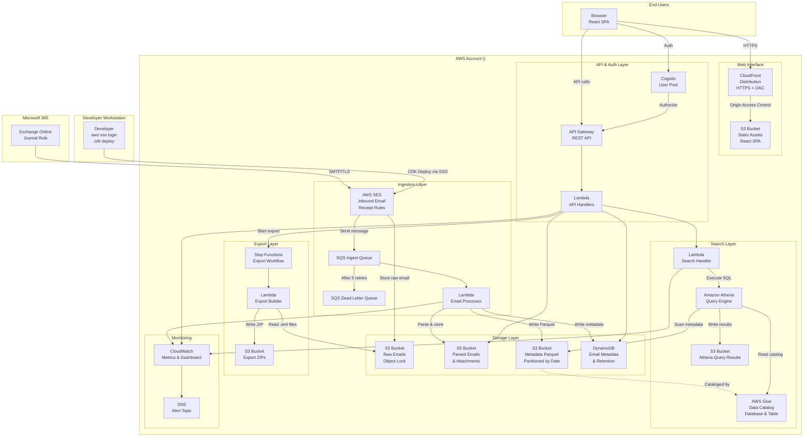
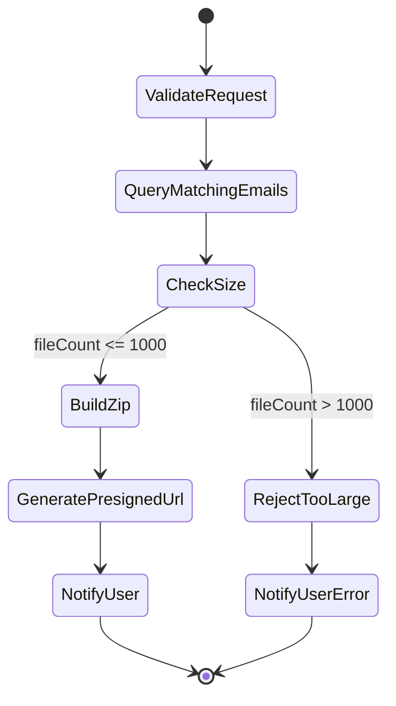
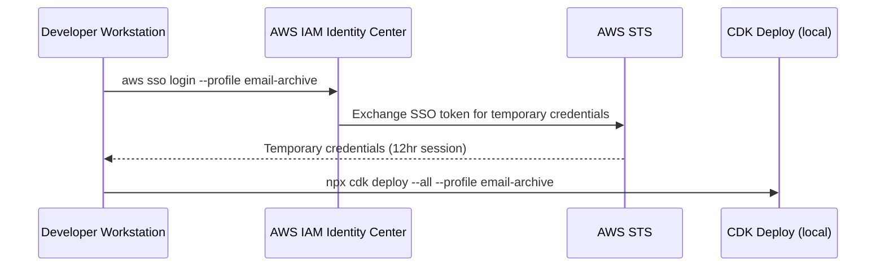

# Design Document: Email Archive Solution

## Overview

The Email Archive Solution is an AWS-hosted system that ingests, stores, indexes, and provides search capabilities for archived emails from Microsoft 365 Exchange Online. It addresses scenarios where mailboxes exceed the 1.5 TB Online Archive limit and organizations that require email journaling for compliance analysis.

The system is deployed entirely via AWS CDK (TypeScript), stored in a Git repository, and uses AWS IAM Identity Center (SSO) for secure, keyless local deployment to AWS account.

### Key Design Decisions

1. **AWS SES Inbound Email for Ingestion**: AWS SES receives inbound journal emails on a verified domain (up to 40 MB per message), stores the raw email in S3 via Receipt Rules, and triggers a Lambda function for processing. This eliminates the need for a custom SMTP server, load balancer, or container orchestration.
2. **Amazon S3 for Archive Store**: Provides 11-nines durability, unlimited scalability, and S3 Object Lock for immutable retention.
3. **AWS Glue Data Catalog + Amazon Athena for Search**: Replaces OpenSearch Serverless. Email metadata is written as Parquet files in S3 (partitioned by date), cataloged via Glue, and queried via Athena. This reduces cost from ~$700/month (OpenSearch Serverless minimum) to pay-per-query (~$5/TB scanned). Trade-off: no full-text body search — queries are limited to metadata fields (sender, recipient, subject LIKE/contains, date range).
4. **Amazon Cognito for Authentication/RBAC**: Managed user directory with groups for role-based access control (Administrator, Analyst).
5. **AWS IAM Identity Center (SSO)**: No stored AWS credentials — developer authenticates locally via `aws sso login --profile email-archive` to obtain temporary credentials (12-hour session). Deployment is performed locally with `npx cdk deploy --all --profile email-archive`. The SSO permission set is scoped to the services required for CDK deployment.
6. **Single-tenant per AWS account**: Each deployment is fully isolated with no cross-account resource sharing.
7. **ZIP Export via Step Functions**: For export of search results, matching .eml files are packaged into a ZIP in S3 and delivered via presigned URL. Large exports use an async Step Functions workflow to avoid Lambda timeout limits.
8. **Git-hosted source code**: Infrastructure and application code are stored in a Git repository (GitHub, GitLab, Bitbucket, or any Git host). Deployment is local — no CI/CD pipeline is required.
9. **React SPA on S3 + CloudFront**: The web interface is a React (TypeScript) single-page application served as static assets from S3 via CloudFront. This provides a serverless frontend with no servers to maintain, HTTPS by default (ACM certificate), global edge caching via CDN, and cost-effective hosting at scale.

## Architecture

### High-Level Architecture Diagram



### Data Flow

1. **Ingestion**: M365 Exchange Online journal rule sends emails via SMTP/TLS to the SES-verified domain → SES Receipt Rule validates the email (≤40 MB, enforced natively by SES), stores the raw email in S3, and enqueues a processing message to SQS.
2. **Processing**: Lambda processes the SQS message, parses the email (extracts metadata, body, attachments), stores parsed content in S3, writes metadata to DynamoDB, and writes a Parquet metadata record to the metadata S3 bucket (partitioned by year/month/day).
3. **Cataloging**: The Glue Data Catalog maintains a table definition over the Parquet metadata files in S3. The table is registered at deploy time via CDK; new partitions are added by the processor Lambda via Glue `BatchCreatePartition` API after writing Parquet files.
4. **Search**: Users authenticate via Cognito, access the REST API through API Gateway, which invokes the search Lambda. The search Lambda submits a SQL query to Athena against the Glue catalog, polls for results, and returns matching metadata rows.
5. **Export**: When a user requests an export, the API Lambda starts a Step Functions workflow. The export Lambda reads matching .eml files from the raw S3 bucket, packages them into a ZIP in the exports S3 bucket, and returns a presigned URL for download.
6. **Deployment**: Developer authenticates via `aws sso login --profile email-archive` (12-hour session) and runs `npx cdk deploy --all --profile email-archive` locally — no stored credentials or CI/CD pipeline.

## Components and Interfaces

### 1. Email Ingestion Service (AWS SES Inbound)

**Technology**: AWS SES Inbound Email with Receipt Rules, storing to S3 and triggering SQS → Lambda.

**Responsibilities**:
- Receive inbound emails on a verified domain via SES
- Enforce maximum email size (40 MB, handled natively by SES — oversized emails are bounced automatically)
- Store raw email (.eml) to S3 raw bucket via SES Receipt Rule S3 action
- Enqueue processing message to SQS via SES Receipt Rule SNS/SQS action
- Emit ingestion metrics to CloudWatch

**SES Configuration**:
```
Verified Domain: archive.vijay.email (configured in Route53)
Receipt Rule Set: EmailArchiveInboundRules
Receipt Rules:
  1. Rule: StoreAndProcess
     Recipients: journal@archive.vijay.email
     Actions:
       - S3 Action: Store to email-archive-raw-{accountId} bucket
         Object Key Prefix: inbound/
         KMS Encryption: Customer-managed key
       - SNS/SQS Action: Publish S3 key to SQS ingest queue
Max Message Size: 40 MB (SES hard limit, enforced automatically)
```

**MX Record**: Route53 MX record pointing to SES inbound endpoint (e.g., `inbound-smtp.us-east-1.amazonaws.com`).

**Size Handling**: SES natively rejects emails exceeding 40 MB with a bounce response — no application-level size validation code is needed.

### 2. Email Processor (Lambda)

**Technology**: AWS Lambda (Node.js 20.x runtime), triggered by SQS.

**Responsibilities**:
- Retrieve raw email from S3
- Parse MIME structure (using `mailparser` library)
- Extract: sender, recipients (To, Cc, Bcc), date, subject, message ID, headers, body (text + HTML), attachments
- Store parsed email body and each attachment individually in S3 parsed bucket
- Write email metadata record to DynamoDB
- Write Parquet metadata record to S3 metadata bucket (partitioned by year/month/day)
- Register new partition in Glue Data Catalog via `BatchCreatePartition` API
- Handle retries (SQS visibility timeout + maxReceiveCount = 5)

**Interface**:
```typescript
interface EmailMetadata {
  emailId: string;          // UUID v4
  messageId: string;        // RFC 5322 Message-ID
  sender: string;
  recipients: string[];
  ccRecipients: string[];
  bccRecipients: string[];
  subject: string;
  date: string;             // ISO 8601
  archivedAt: string;       // ISO 8601
  bodyS3Key: string;
  attachments: AttachmentMeta[];
  rawS3Key: string;
  sizeBytes: number;
  retentionPolicyId: string;
  retentionExpiresAt?: string;
}

interface AttachmentMeta {
  attachmentId: string;
  fileName: string;
  fileType: string;
  sizeBytes: number;
  s3Key: string;
}
```

### 3. Archive Store (S3 + DynamoDB)

**S3 Buckets**:
- `email-archive-raw-{accountId}`: Raw .eml files with S3 Object Lock (Governance mode) for retention enforcement
- `email-archive-parsed-{accountId}`: Parsed bodies and attachments

**S3 Configuration**:
- Server-side encryption: SSE-KMS (AES-256) with customer-managed KMS key
- Versioning enabled
- Object Lock enabled on raw bucket for immutable retention
- Lifecycle rules: Transition to Intelligent-Tiering after 90 days
- Bucket policy: deny unencrypted transport (enforce TLS)

**DynamoDB Table**: `EmailMetadata`
- Partition Key: `emailId` (String)
- GSI-1: `sender-date-index` (PK: sender, SK: date)
- GSI-2: `messageId-index` (PK: messageId)
- GSI-3: `retentionExpiresAt-index` (PK: retentionPolicyId, SK: retentionExpiresAt)
- Encryption: AWS-managed KMS key
- Point-in-time recovery: Enabled
- Billing mode: On-demand

### 4. Search Service (Glue Data Catalog + Amazon Athena)

**Technology**: AWS Glue Data Catalog + Amazon Athena (serverless SQL query engine)

**S3 Metadata Bucket**: `email-archive-metadata-{accountId}`
- Format: Apache Parquet
- Partitioning: `year=YYYY/month=MM/day=DD/`
- Encryption: SSE-KMS with customer-managed key
- Lifecycle: No expiration (metadata retained as long as emails exist)

**Glue Database & Table**:
```
Database: email_archive
Table: email_metadata

Schema:
  emailId        STRING    -- UUID v4
  messageId      STRING    -- RFC 5322 Message-ID
  sender         STRING    -- Envelope sender address
  recipients     ARRAY<STRING>  -- Envelope recipients
  ccRecipients   ARRAY<STRING>
  bccRecipients  ARRAY<STRING>
  subject        STRING
  date           TIMESTAMP -- Original email date
  archivedAt     TIMESTAMP -- Archive timestamp
  hasAttachments BOOLEAN
  attachmentCount INT
  totalSizeBytes BIGINT

Partition Keys:
  year   STRING
  month  STRING
  day    STRING

Storage Location: s3://email-archive-metadata-{accountId}/metadata/
SerDe: org.apache.hadoop.hive.ql.io.parquet.serde.ParquetHiveSerDe
Input Format: org.apache.hadoop.hive.ql.io.parquet.MapredParquetInputFormat
```

**Athena Workgroup**: `email-archive-search`
- Query result location: `s3://email-archive-athena-results-{accountId}/`
- Bytes scanned limit per query: 10 GB (prevents runaway queries)
- Enforce workgroup settings: true
- Result encryption: SSE-KMS

**Search Lambda** (`email-archive-search-handler`):
- Submits Athena `StartQueryExecution` with parameterized SQL
- Polls `GetQueryExecution` until SUCCEEDED, FAILED, or CANCELLED (max 30s timeout)
- Reads results from `GetQueryResults`
- Translates rows into API response format

**Query Construction**:
```sql
-- Example generated query (parameterized, not string-interpolated)
SELECT emailId, sender, recipients, subject, date, hasAttachments, attachmentCount
FROM email_archive.email_metadata
WHERE year BETWEEN :yearFrom AND :yearTo
  AND sender = :sender
  AND contains(subject, :subjectKeyword)
ORDER BY date DESC
LIMIT :pageSize OFFSET :offset
```

**Note**: All query parameters are passed via Athena parameterized queries to prevent SQL injection. The Lambda constructs WHERE clauses dynamically based on which filters are provided.

### 5. Export Service (Step Functions + Lambda)

**Technology**: AWS Step Functions (Express Workflow) + Lambda

**Responsibilities**:
- Package matching .eml files from S3 raw bucket into a ZIP archive
- Handle large exports (>100 files or >500 MB) asynchronously via Step Functions
- Generate S3 presigned URL for download (1-hour expiry)
- Track export job status in DynamoDB

**Step Functions Workflow** (`EmailArchiveExportWorkflow`):


**Export S3 Bucket**: `email-archive-exports-{accountId}`
- Lifecycle rule: Delete objects after 24 hours (exports are temporary)
- Encryption: SSE-KMS

**Export Job Record** (DynamoDB):
```typescript
interface ExportJob {
  exportId: string;           // UUID v4
  userId: string;             // Cognito user ID
  status: 'PENDING' | 'RUNNING' | 'COMPLETED' | 'FAILED';
  searchQuery: SearchQuery;   // Original query that produced results
  fileCount: number;
  totalSizeBytes: number;
  s3Key?: string;             // Key of ZIP in exports bucket
  presignedUrl?: string;      // Presigned download URL
  expiresAt?: string;         // URL expiry time
  createdAt: string;
  completedAt?: string;
  errorMessage?: string;
}
```

### 6. API Layer (API Gateway + Lambda)

**Technology**: Amazon API Gateway (REST API) with AWS Lambda integrations.

**Endpoints**:
```
POST   /auth/login              - Cognito authentication (returns JWT)
POST   /auth/refresh            - Refresh token
POST   /search                  - Execute metadata search query (Athena)
GET    /emails/{emailId}        - Get full email content
GET    /emails/{emailId}/attachments/{attachmentId} - Download attachment
POST   /exports                 - Request export of search results (starts Step Functions)
GET    /exports/{exportId}      - Get export job status and download URL
GET    /retention-policies      - List retention policies (Admin only)
POST   /retention-policies      - Create retention policy (Admin only)
PUT    /retention-policies/{id} - Update retention policy (Admin only)
GET    /health                  - Health check
```

**Authorization**: Cognito User Pool Authorizer on API Gateway. Group-based access:
- `Administrator` group: Full access to all endpoints
- `Analyst` group: Access to /search, /emails/*, /exports/*, and /auth/* endpoints only

### 7. Authentication & Authorization (Cognito)

**Amazon Cognito User Pool Configuration**:
- Password policy: Minimum 12 characters, uppercase, lowercase, numbers, special characters
- MFA: Optional (recommended for Administrators)
- Account lockout: 5 failed attempts → 15-minute lockout (custom Lambda trigger)
- Session expiry: 30-minute idle timeout (token validity configuration)
- Groups: `Administrator`, `Analyst`

**Token Configuration**:
- Access token validity: 30 minutes
- Refresh token validity: 24 hours
- ID token validity: 30 minutes

### 8. Secure Deployment (IAM Identity Center / SSO)

**Architecture**:


**IAM Identity Center Configuration**:
- Instance type: Organization-level (or account-level for standalone accounts)
- User/Group assignment: Assigned to the developer(s) who perform deployments

**Permission Set**: `EmailArchiveDeployer`
- Session duration: 12 hours
- Managed policies: None (inline policy only for least-privilege)
- Inline policy: Scoped to services required for CDK deployment
- Permissions boundary: `EmailArchiveDeployBoundary` (attached to the permission set)

**Permissions Boundary** (`EmailArchiveDeployBoundary`):
- Allows: CloudFormation, S3, Lambda, SES, DynamoDB, Glue, Athena, Step Functions, Cognito, API Gateway, SQS, SNS, CloudWatch, KMS, IAM (create roles with boundary), Logs, ACM, Route53
- Denies: IAM actions without the permissions boundary attached, cross-account actions

**Permission Set Inline Policy** (services allowed):
```json
{
  "Version": "2012-10-17",
  "Statement": [
    {
      "Effect": "Allow",
      "Action": [
        "cloudformation:*",
        "s3:*",
        "lambda:*",
        "ses:*",
        "dynamodb:*",
        "glue:*",
        "athena:*",
        "states:*",
        "cognito-idp:*",
        "apigateway:*",
        "sqs:*",
        "sns:*",
        "logs:*",
        "cloudwatch:*",
        "kms:*",
        "iam:*",
        "acm:*",
        "route53:*",
        "sts:*",
        "ssm:*"
      ],
      "Resource": "*",
      "Condition": {
        "StringEquals": {
          "aws:RequestedRegion": "us-east-1"
        }
      }
    }
  ]
}
```

**AWS CLI Profile Configuration** (`~/.aws/config`):
```ini
[profile email-archive]
sso_session = email-archive-sso
sso_account_id = <YOUR_ACCOUNT_ID>
sso_role_name = EmailArchiveDeployer
region = us-east-1
output = json

[sso-session email-archive-sso]
sso_start_url = https://your-org.awsapps.com/start
sso_region = us-east-1
sso_registration_scopes = sso:account:access
```

**Deployment Workflow** (local):
```bash
# 1. Authenticate via SSO (opens browser for login)
aws sso login --profile email-archive

# 2. Deploy all stacks
npx cdk deploy --all --profile email-archive

# 3. (Optional) Verify deployment
npx cdk diff --all --profile email-archive
```

**Session Management**:
- Session duration: 12 hours (configured in the permission set)
- When session expires: Re-run `aws sso login --profile email-archive`
- No long-lived access keys are stored anywhere

### 9. Monitoring & Alerting

**CloudWatch Metrics** (custom namespace: `EmailArchive`):
- `IngestionRate` (count/minute)
- `IngestionFailures` (count/minute)
- `IngestionLatency` (milliseconds)
- `StorageUtilization` (bytes, percentage)
- `SearchQueryLatency` (milliseconds, p50/p95/p99) — Athena query execution time
- `ExportJobDuration` (milliseconds)
- `ExportJobFailures` (count)
- `ActiveSessions` (count)

**CloudWatch Alarms**:
| Alarm | Threshold | Action |
|-------|-----------|--------|
| High Ingestion Failure Rate | >5% failures in 5 min | SNS alert |
| Storage 80% Warning | >80% utilized | SNS warning |
| Storage 100% Critical | 100% utilized | SNS critical + reject writes |
| Search Latency High | p95 > 10s over 5 min | SNS alert |

**CloudWatch Dashboard**: `EmailArchive-SystemHealth`
- Ingestion rate and success/failure counts
- Storage utilization (total size, percentage)
- Search latency (p50, p95, p99)
- Active errors and DLQ depth

### 10. Retention Policy Engine

**Technology**: DynamoDB table + EventBridge Scheduler + Lambda

**DynamoDB Table**: `RetentionPolicies`
```typescript
interface RetentionPolicy {
  policyId: string;
  name: string;
  durationDays: number;     // 1-36500, or -1 for indefinite
  createdAt: string;
  updatedAt: string;
  createdBy: string;
}
```

**Retention Evaluation**:
- EventBridge Scheduler runs Lambda every hour
- Lambda queries DynamoDB GSI for emails where `retentionExpiresAt <= now()`
- Marks eligible emails as `purgeEligible: true`
- Does NOT delete — a separate admin-triggered purge process handles actual deletion
- S3 Object Lock prevents deletion of emails still under retention

### 11. Web Interface (React SPA)

**Technology**: React (TypeScript) single-page application, built as static assets, hosted on S3 and served via CloudFront.

**Responsibilities**:
- Provide user-facing interface for authentication, email search, email viewing, export, and admin functions
- Authenticate users via Cognito (using AWS Amplify Auth library or `@aws-sdk/client-cognito-identity-provider`)
- Communicate with the backend exclusively through the API Gateway REST API
- Handle session management, token refresh, and idle timeout on the client side

**Hosting Architecture**:
- **S3 Bucket**: `email-archive-web-{accountId}` — stores built static assets (HTML, JS, CSS, images)
  - Static website hosting is NOT enabled on the bucket (CloudFront serves content directly via OAC)
  - Server-side encryption: SSE-S3
  - Public access: Blocked (all access via CloudFront only)
  - Bucket policy: Allows only the CloudFront distribution's OAC to `s3:GetObject`
- **CloudFront Distribution**:
  - Origin: S3 bucket with Origin Access Control (OAC)
  - Protocol: HTTPS only (HTTP redirects to HTTPS)
  - SSL Certificate: ACM certificate (us-east-1) — custom domain optional
  - Default root object: `index.html`
  - Error pages: 403/404 → `index.html` (SPA client-side routing)
  - Cache behavior: Cache static assets with long TTL; `index.html` with short TTL or no-cache for deployments
  - Price class: PriceClass_100 (North America + Europe) — adjustable per tenant needs

**Authentication Integration**:
- Uses AWS Amplify Auth (or direct Cognito SDK) to perform user sign-in against the Cognito User Pool
- Stores tokens (access, ID, refresh) in browser memory (not localStorage for security)
- Attaches the Cognito access token as `Authorization: Bearer <token>` header on all API requests
- Handles token refresh automatically before expiry
- Detects 30-minute idle timeout client-side and forces re-authentication

**Pages/Views**:

| Page | Path | Access | Description |
|------|------|--------|-------------|
| Login | `/login` | Public | Cognito sign-in form, redirects to Search on success |
| Search | `/search` | Analyst, Administrator | Search form (sender, recipient, subject, date range), paginated results table, export button |
| Email Detail | `/emails/:emailId` | Analyst, Administrator | Full email view: metadata, body (text/HTML), attachment download links |
| Retention Policies | `/admin/retention-policies` | Administrator only | List, create, and edit retention policies |
| Dashboard | `/admin/dashboard` | Administrator only | Embedded CloudWatch dashboard or custom metrics view (ingestion rate, storage, errors) |

**Deployment**:
- Built via `npm run build` (produces optimized static bundle in `build/` or `dist/`)
- Deployed to S3 via CDK `BucketDeployment` construct (syncs static assets to the bucket)
- CloudFront cache invalidation triggered on deployment for `index.html`
- No server-side rendering — fully static client-side application

**CDK Construct Usage**:
```typescript
// S3 bucket for static assets
const webBucket = new s3.Bucket(this, 'WebBucket', {
  bucketName: `email-archive-web-${accountId}`,
  encryption: s3.BucketEncryption.S3_MANAGED,
  blockPublicAccess: s3.BlockPublicAccess.BLOCK_ALL,
  removalPolicy: cdk.RemovalPolicy.DESTROY,
  autoDeleteObjects: true,
});

// CloudFront distribution
const distribution = new cloudfront.Distribution(this, 'WebDistribution', {
  defaultBehavior: {
    origin: new origins.S3BucketOrigin(webBucket),
    viewerProtocolPolicy: cloudfront.ViewerProtocolPolicy.REDIRECT_TO_HTTPS,
  },
  defaultRootObject: 'index.html',
  errorResponses: [
    { httpStatus: 403, responsePagePath: '/index.html', responseHttpStatus: 200 },
    { httpStatus: 404, responsePagePath: '/index.html', responseHttpStatus: 200 },
  ],
});

// Deploy static assets
new s3deploy.BucketDeployment(this, 'WebDeployment', {
  sources: [s3deploy.Source.asset('./frontend/dist')],
  destinationBucket: webBucket,
  distribution,
  distributionPaths: ['/index.html'],
});
```

**API Communication**:
- Base URL configured via environment variable at build time (API Gateway endpoint URL)
- All API calls use `fetch` or a lightweight HTTP client (e.g., `axios`)
- Request interceptor attaches Authorization header from Cognito session
- Response interceptor handles 401 (redirect to login) and 403 (show access denied)

## Data Models

### Email Record (DynamoDB)

```typescript
interface EmailRecord {
  // Keys
  emailId: string;                    // PK - UUID v4
  
  // Core metadata
  messageId: string;                  // RFC 5322 Message-ID
  sender: string;                     // Envelope sender
  recipients: string[];               // Envelope recipients
  ccRecipients: string[];
  bccRecipients: string[];
  subject: string;
  date: string;                       // Original email date (ISO 8601)
  archivedAt: string;                 // Archive timestamp (ISO 8601)
  
  // Storage references
  rawS3Key: string;                   // Key in raw bucket
  bodyS3Key: string;                  // Key in parsed bucket
  bodyHtmlS3Key?: string;             // HTML body if present
  attachments: AttachmentRecord[];
  
  // Size & limits
  totalSizeBytes: number;
  attachmentCount: number;
  
  // Retention
  retentionPolicyId: string;
  retentionExpiresAt?: string;        // ISO 8601, absent if indefinite
  purgeEligible: boolean;
  
  // Audit
  lastAccessedAt?: string;
  lastAccessedBy?: string;
}

interface AttachmentRecord {
  attachmentId: string;               // UUID v4
  fileName: string;
  fileType: string;                   // MIME type
  sizeBytes: number;
  s3Key: string;                      // Key in parsed bucket
  contentHash: string;                // SHA-256 for integrity
}
```

### Retention Policy (DynamoDB)

```typescript
interface RetentionPolicyRecord {
  policyId: string;                   // PK - UUID v4
  name: string;
  durationDays: number;               // 1-36500, or -1 for indefinite
  isIndefinite: boolean;
  createdAt: string;
  updatedAt: string;
  createdBy: string;                  // Cognito user ID
  emailCount?: number;                // Approximate count of emails under this policy
}
```

### Audit Log (CloudWatch Logs + DynamoDB)

```typescript
interface AuditEntry {
  auditId: string;
  userId: string;
  userRole: string;
  timestamp: string;
  operation: 'SEARCH' | 'VIEW_EMAIL' | 'DOWNLOAD_ATTACHMENT' | 'CREATE_POLICY' | 'UPDATE_POLICY' | 'LOGIN' | 'LOGOUT';
  resourceId?: string;
  requestDetails: Record<string, unknown>;
  sourceIp: string;
  userAgent: string;
}
```

### Search Query Model

```typescript
interface SearchQuery {
  sender?: string;                    // Exact match on sender address
  recipient?: string;                 // Exact match within recipients array
  subjectContains?: string;           // LIKE/contains match on subject
  dateFrom?: string;                  // ISO 8601 (inclusive)
  dateTo?: string;                    // ISO 8601 (inclusive)
  hasAttachments?: boolean;
  page?: number;                      // Default: 1
  pageSize?: number;                  // Default: 25, max: 100
  sortField?: 'date' | 'sender' | 'subject';
  sortOrder?: 'asc' | 'desc';        // Default: desc
}

interface SearchResult {
  totalCount: number;
  page: number;
  pageSize: number;
  totalPages: number;
  queryExecutionId: string;           // Athena query execution ID (for debugging)
  results: SearchResultItem[];
}

interface SearchResultItem {
  emailId: string;
  sender: string;
  recipients: string[];
  date: string;
  subject: string;
  hasAttachments: boolean;
  attachmentCount: number;
}
```


## Correctness Properties

*A property is a characteristic or behavior that should hold true across all valid executions of a system — essentially, a formal statement about what the system should do. Properties serve as the bridge between human-readable specifications and machine-verifiable correctness guarantees.*

### Property 1: Email Size Validation

*For any* email with a total size in bytes, the size validation function SHALL accept the email if and only if its size is less than or equal to 40 MB (41,943,040 bytes), and SHALL reject it with a size-limit-exceeded error otherwise.

**Validates: Requirements 1.1, 1.7**

### Property 2: Email Parsing Completeness

*For any* valid MIME email message containing between 0 and 500 attachments, the email parser SHALL extract the sender, all recipients (To, Cc, Bcc), date, subject, message ID, complete message body, and every attachment with its file name, file type, and size — such that the count of extracted attachments equals the count present in the source message and all metadata fields are non-null.

**Validates: Requirements 1.2**

### Property 3: Email Storage Round-Trip

*For any* email record stored in the archive, retrieving that record by its unique identifier SHALL return content byte-for-byte identical to the original email including all headers, body, and attachments.

**Validates: Requirements 1.3, 2.3**

### Property 4: Retry Backoff Calculation

*For any* retry attempt number N (where 1 ≤ N ≤ 5), the computed backoff delay SHALL equal 30 × 2^(N-1) seconds (i.e., 30s, 60s, 120s, 240s, 480s).

**Validates: Requirements 1.4**

### Property 5: Retention Evaluation Correctness

*For any* email with an archived date and an associated retention policy (either finite duration or indefinite), the retention evaluation function SHALL:
- Mark the email as NOT purge-eligible if the current time is before `archivedAt + durationDays`, OR if the policy is indefinite
- Mark the email as purge-eligible if the current time is at or after `archivedAt + durationDays` AND no indefinite-retention policy applies

**Validates: Requirements 2.4, 2.5, 8.2, 8.3, 8.5**

### Property 6: Storage Capacity Threshold Actions

*For any* storage utilization percentage value, the threshold evaluation function SHALL:
- Return `ACCEPT` (no alert) when utilization < 80%
- Return `ACCEPT_WITH_WARNING` when 80% ≤ utilization < 100%
- Return `REJECT` when utilization ≥ 100%

**Validates: Requirements 2.7, 7.3**

### Property 7: Metadata Parquet Record Completeness

*For any* email record processed by the ingestion pipeline, the generated Parquet metadata record SHALL contain non-null values for: emailId, sender, recipients, date, subject, hasAttachments, and attachmentCount — and the partition keys (year, month, day) SHALL correctly correspond to the email's date.

**Validates: Requirements 3.1**

### Property 8: Search Filter Correctness (AND Logic)

*For any* search query with one or more filter criteria (date range, sender, recipient, subject keywords, has-attachments), every email in the result set SHALL satisfy ALL active filter criteria simultaneously, and no email satisfying all criteria SHALL be excluded from results.

**Validates: Requirements 3.3, 3.4**

### Property 9: Search Result Formatting Invariants

*For any* non-empty search result set, results SHALL be sorted by date descending, the page size SHALL not exceed 25 items, and each result item SHALL contain sender, recipients, date, subject, hasAttachments, and attachmentCount.

**Validates: Requirements 3.4**

### Property 10: Empty Query Rejection

*For any* search query where all search terms are empty/null/whitespace AND all filter criteria are unset, the search function SHALL reject the query with a validation error.

**Validates: Requirements 3.9**

### Property 11: Account Lockout Logic

*For any* user with a sequence of N consecutive failed authentication attempts, the account SHALL be locked if and only if N ≥ 5, and the lockout duration SHALL be at least 15 minutes.

**Validates: Requirements 5.4**

### Property 12: RBAC Access Control

*For any* combination of user role (Administrator, Analyst, or unauthenticated) and API endpoint, the authorization function SHALL grant access if and only if the role has permission for that endpoint according to the access matrix, and SHALL deny and log all other requests.

**Validates: Requirements 5.5, 5.6**

### Property 13: Audit Log Completeness

*For any* system operation (search, view email, download attachment, policy change, login, logout), the generated audit log entry SHALL contain: user identity, timestamp, operation type, resource identifier, and source IP address.

**Validates: Requirements 5.7**

### Property 14: Session Timeout

*For any* active user session, if the elapsed time since last activity exceeds 30 minutes, the session validation function SHALL return expired status requiring re-authentication.

**Validates: Requirements 5.9**

### Property 15: Tenant-Scoped Resource Naming

*For any* resource provisioned by the deployment stack, the resource name SHALL contain the tenant's AWS account ID as a component, ensuring uniqueness within the account.

**Validates: Requirements 6.5**

### Property 16: Ingestion Failure Rate Alerting

*For any* 5-minute window of ingestion attempts, if the ratio of failed attempts to total attempts exceeds 0.05 (5%), the alerting function SHALL trigger a notification.

**Validates: Requirements 7.2**

### Property 17: Retention Policy Duration Validation

*For any* retention policy creation or modification request, the system SHALL accept the request if and only if the duration is between 1 and 36,500 days (inclusive) or is specified as indefinite, and SHALL reject with a validation error otherwise.

**Validates: Requirements 8.1, 8.6**

### Property 18: Retention Policy Update Forward-Only Application

*For any* retention policy modification, emails whose retention period had already elapsed prior to the modification SHALL remain in their current state (purge-eligible), while emails still under retention SHALL be evaluated using the updated policy duration.

**Validates: Requirements 8.4**

### Property 19: Athena SQL Query Construction Safety

*For any* SearchQuery input with arbitrary string values for sender, recipient, and subjectContains fields, the generated Athena SQL query SHALL use parameterized query execution and SHALL never embed user input directly into the SQL string, preventing SQL injection.

**Validates: Requirements 3.2, 3.3**

### Property 20: Export ZIP Content Correctness

*For any* set of email IDs produced by a search query, the generated export ZIP file SHALL contain exactly one .eml file per email ID, and each .eml file SHALL be byte-for-byte identical to the corresponding raw email stored in S3.

**Validates: Requirements 3.6**

## Error Handling

### Ingestion Errors

| Error Condition | Handling | Recovery |
|----------------|----------|----------|
| Email exceeds 40 MB | SES rejects with bounce (native enforcement) | Bounce notification to admin via SNS, email stays in M365 |
| SES receipt rule failure | SES retries delivery | CloudWatch alarm on SES bounce/complaint metrics |
| S3 write failure (SES action) | SES retries the action | Alert on SES delivery failure notification |
| S3 write failure (processing) | SQS retry with exponential backoff (30s base, 5 attempts) | DLQ + critical alert |
| MIME parsing failure | Move to DLQ with parse error metadata | Manual review queue |
| SQS delivery failure | SQS built-in retry | CloudWatch alarm on queue depth |

### Storage Errors

| Error Condition | Handling | Recovery |
|----------------|----------|----------|
| S3 put failure | Retry 3 times, then report to ingest queue | Email remains in ingest queue |
| DynamoDB write failure | Retry with exponential backoff | SQS re-delivery |
| Capacity at 90% | Warning alert via SNS | Admin provisions additional capacity or adjusts retention |
| Capacity at 100% | Reject new writes with 507 error | Critical alert, immediate admin action |

### Search Errors

| Error Condition | Handling | Recovery |
|----------------|----------|----------|
| Athena query timeout (>30s) | Return 504 with preserved query | User retries; consider narrowing date range |
| Athena query failure (invalid SQL) | Return 400 with validation details | Log malformed query for debugging |
| Athena FAILED status | Return 500 with error message from Athena | CloudWatch alarm, admin investigates |
| Athena bytes-scanned limit exceeded | Return 413 with suggestion to narrow filters | User adds more specific filters |
| Glue table/partition not found | Return 503 with "index unavailable" message | Alert admin to re-run partition registration |
| S3 metadata bucket inaccessible | Return 503 | CloudWatch alarm, check bucket policy |
| Export ZIP generation failure | Mark export job as FAILED | User retries export; admin checks Lambda logs |
| Export file count exceeds limit (>1000) | Return 400 with message to narrow query | User refines search criteria |

### Authentication Errors

| Error Condition | Handling | Recovery |
|----------------|----------|----------|
| Invalid credentials | 401 response, increment failure counter | User retries |
| Account locked (5 failures) | 403 response with lockout duration | 15-minute automatic unlock |
| Expired token | 401 response | Client uses refresh token |
| Expired session (30 min idle) | 401 response | User re-authenticates |

### Deployment Errors

| Error Condition | Handling | Recovery |
|----------------|----------|----------|
| CloudFormation rollback | Automatic rollback of all resources | Fix code, redeploy |
| SSO session expired | CDK deploy fails with credential error | Re-run `aws sso login --profile email-archive` |
| Permission boundary violation | Deploy role denied | Review boundary policy |
| Existing deployment conflict | Halt with conflict error | Resolve or choose different account |

## Testing Strategy

### Unit Tests

Unit tests verify specific examples, edge cases, and error conditions using **Jest** (TypeScript).

**Scope:**
- Email MIME parsing with specific email fixtures
- DynamoDB record serialization/deserialization
- Athena SQL query builder with specific filter combinations
- Parquet metadata record construction
- Retention policy evaluation with concrete date examples
- Export ZIP assembly with sample .eml files
- API request validation
- Error response formatting
- CDK snapshot tests for infrastructure correctness

### Property-Based Tests

Property-based tests verify universal properties across randomized inputs using **fast-check** (TypeScript PBT library).

**Configuration:**
- Minimum 100 iterations per property test
- Each test tagged with: `Feature: email-archive-solution, Property {N}: {property_text}`

**Properties to implement:**
1. Email size validation (Property 1)
2. Email parsing completeness (Property 2)
3. Email storage round-trip (Property 3)
4. Retry backoff calculation (Property 4)
5. Retention evaluation correctness (Property 5)
6. Storage capacity threshold actions (Property 6)
7. Metadata Parquet record completeness (Property 7)
8. Search filter AND logic (Property 8)
9. Search result formatting invariants (Property 9)
10. Empty query rejection (Property 10)
11. Account lockout logic (Property 11)
12. RBAC access control (Property 12)
13. Audit log completeness (Property 13)
14. Session timeout (Property 14)
15. Tenant-scoped naming (Property 15)
16. Ingestion failure rate alerting (Property 16)
17. Retention policy duration validation (Property 17)
18. Retention policy update forward-only (Property 18)
19. Athena SQL query construction safety (Property 19)
20. Export ZIP content correctness (Property 20)

### Integration Tests

Integration tests verify component interactions and AWS service behavior.

**Scope:**
- End-to-end email ingestion (SES → S3 → SQS → Lambda → DynamoDB → Parquet/S3)
- Athena query execution against sample Parquet metadata
- Glue catalog partition registration
- Export workflow (Step Functions → Lambda → ZIP in S3 → presigned URL)
- Cognito authentication flow
- API Gateway authorization enforcement
- S3 Object Lock retention enforcement
- CloudWatch metrics emission and alarm triggering

### CDK Infrastructure Tests

**CDK Assertions** verify the synthesized CloudFormation template:
- All expected resources are present
- Encryption is configured on all storage resources
- No cross-account IAM principals
- Correct retention policies on stateful resources
- Permissions boundary attached to all created roles
- No long-lived credentials or access keys in any resource

### Test Environment

- **Unit/Property tests**: Run locally, no AWS resources needed (mocked)
- **Integration tests**: Dedicated test AWS account or localstack
- **CDK tests**: `cdk synth` + assertion library, no deployment needed
- **Performance tests**: Staging environment with representative data volume
